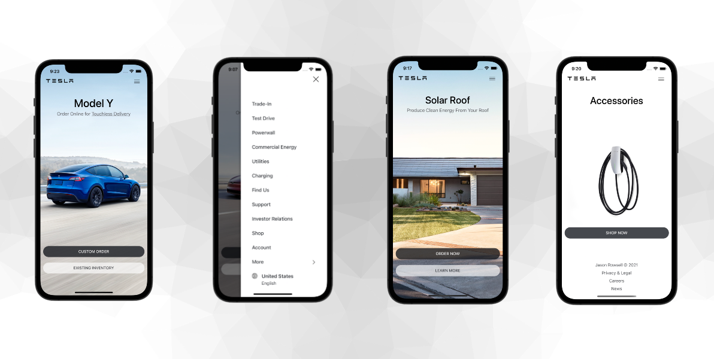

<div id="top"></div>

<!-- PROJECT LOGO -->
<br />
<div align="center">
  <a href="https://expo.dev/@jasonrowsell/expo-tesla">
    
  </a>

  <h3 align="center">Tesla Clone with React Native</h3>

  <p align="center">
    A Tesla app UI clone built with React Native / Expo.
    <br />
    <br />
    <a href="https://expo.dev/@jasonrowsell/expo-tesla"><strong>View Demo</strong></a>
    <br />
    <br />
    <a href="https://github.com/jasonrowsell/expo-tesla/issues">Report Bug</a>
    ·
    <a href="https://github.com/jasonrowsell/expo-tesla/issues">Request Feature</a>
    <br />
    <br />
    <a href="https://expo.dev/@jasonrowsell/expo-tesla">
      
    </a>
    <br />
  </p>
</div>

<!-- TABLE OF CONTENTS -->
## Table of Contents

- [Overview](#overview)
- [Getting Started](#getting-started)
  - [Development](#development)
  - [Linting](#linting)
- [Features](#features)
- [Design](#design)
  - [API Components/Packages Used](#api-componentspackages-used)
  - [Testing](#testing)
- [License](#license)

<!-- OVERVIEW -->
## Overview


A Tesla app UI clone built with React Native and Expo. The app has been developed 
to include the features and functionality from the current Tesla app. 
Jest and React Native Testing Library are used for test coverage and
test automation purposes.

## Getting Started

### Development

First, make sure you have Expo CLI installed:

```
npm install -g expo-cli
```

Install JavaScript dependencies:

```
yarn install
```

Finally, run the test suite to verify that everything is working correctly:

```
yarn test
```

If the test suite passes, you'll be ready to run the app in a local server:

```
yarn start
```

### Linting

- Run `yarn lint` for a list of linting warnings/error in the CLI
- `airbnb` config

[Contents](#table-of-contents)

--------

## Design

### API Components/Packages Used

- React Native
  - `Animated`
  - `Alert` and `Switch`
  - `Image` and `ImageBackground`
  - `Pressable`, `TouchableOpacity` and `TouchableWithoutFeedback`
  - `Dimensions` and `StatusBar`
  - `ScrollView` and `FlatList`
  - `StyleSheet`, `Text`, and `View`
- Expo
  - `expo-asset`
  - `expo-constants`
  - `expo-font`
  - `expo-linear-gradient`
  - `AppLoading`
  - `ScreenOrientation`
  
### Testing


Extensive testing and error checking was undertaken throughout the development process. 

- Test Coverage: ~99%%, Jest
- Prominence on BDD (Behaviour Driven Development)
- Automated feature testing
- Unit tests in isolation
- Red Green Refactor loop

[Contents](#table-of-contents)

--------

<!-- LICENSE -->

## License

Distributed under the MIT License. See [LICENSE](./LICENSE) for more information.

<div align="center">
<br />

---

[Top](#table-of-contents)

---

</div>
